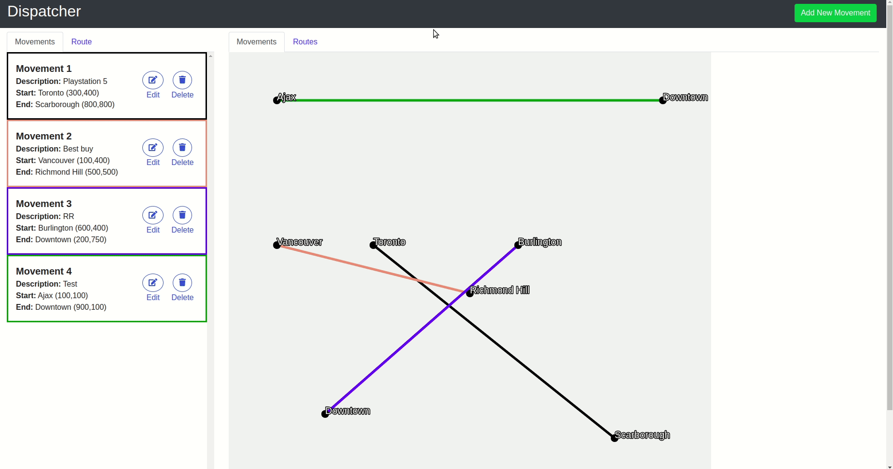

# Dispatcher Router

React Redux SPA for dispatchers to create, update and delete movements and view optimized driving routes for these movements.

## Basic Features

1. Dispatchers can create movements. Each movement will have a start, end, city name, and description.
2. Dispatchers can update movements.
3. Movements will be validated (does not already exist and start and end points are different) upon creating and updating. City names do not affect validation.
4. Dispatchers can delete movements.
5. Dispatchers will be shown a list of all available movements or the optimized route for these movements in the sidebar.
6. Dispatchers will be shown a map of all available movements or the optimized route depending on the view.
7. Dispatchers can make a clear distinction between the list of movements and their representation on the map either by looking at the label on the map or hovering the movement list item.

Read about additional features [here](./FEATURES.md)

## Demo

## Setup Guide

1. `git clone https://github.com/rickychhoukdean/dispatcher-router.git`
2. `cd dispatcher-router/`
3. `npm i`
4. `npm run start`
5. The website should be now running on http://localhost:3000/
6. You can also view the deployed application at https://dispatcher-router.netlify.app/

## Things to note

    - I've left some sample movements in the initial state of the app. Please feel free to remove from the movements array in the reducers/index.js
    - Lat and longs are to be between 0-1000 due to the use of HTML canvas

## Dependencies

    "@fortawesome/fontawesome-svg-core": "^1.2.25",
    "@fortawesome/free-solid-svg-icons": "^5.11.2",
    "@fortawesome/react-fontawesome": "^0.1.5",
    "@testing-library/jest-dom": "^5.11.4",
    "@testing-library/react": "^11.1.0",
    "@testing-library/user-event": "^12.1.10",
    "bootstrap": "^4.5.3",
    "node-sass": "^4.14.1",
    "react": "^17.0.1",
    "react-bootstrap": "^1.4.3",
    "react-dom": "^17.0.1",
    "react-redux": "^7.2.2",
    "react-scripts": "4.0.1",
    "react-toastify": "^6.2.0",
    "redux": "^4.0.5",
    "web-vitals": "^0.2.4"
